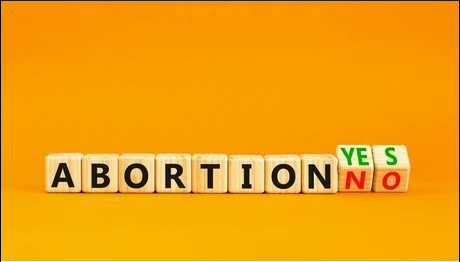

# Data Vs. Dogma: Maternal Wellness Conditions and Abortion Policy per State

## Introduction 
Abortion is a highly contentious and polarizing political issue in the United States. The 1973 Supreme Court decision in Roe v. Wade established a constitutional right to abortion at the federal level, but this ruling was overturned in 2022, making abortion regulation a state-level matter. Despite the polarized political landscape, public opinion surveys consistently show that a majority of Americans support the right to abortion, with a 2022 Pew Research study highlighting widespread support for abortion access across various demographics.
Abortion policy now varies significantly across states, reflecting the political leanings of their governments. Some states have enacted sweeping bans or severe restrictions, while others have worked to protect or expand access. This disparity in abortion policies has profound public health implications, as access to abortion services is intrinsically tied to maternal and child health outcomes. Traditionally, debates around abortion have been framed in moral and ethical terms, often overshadowing empirical evidence and data.
This research project aims to take a data-driven approach to objectively examine how abortion policy affects maternal wellness across the United States. The central research question is: **How do state-level abortion policies impact maternal well-being, and what broader factors contribute to state-to-state variation in these outcomes?** By analyzing public health data at the state level, using abortion policy as a key variable, this research seeks to provide a more concrete, evidence-based understanding of the relationship between abortion policy and maternal health, ultimately contributing to the broader policy discourse.

## Research Questions
**Data Science Question:** *What is the association between health and wellness conditions in a state prior to the Dobbs decision and their abortion policy implemented after the ruling?*

1. What is the association between prior maternal health outcomes and abortion policy? 

2. What is the association between prior infant health outcomes and abortion policy?

3. What is the association between prior overall health outcomes and abortion policy?

4. What is the association between prior maternal wellness conditions and abortion policy?

## Contact Info
- Kristin Lloyd: [kml301@georgetown.edu](kml301@georgetown.edu) 
- Viviana Luccioli: [vcl16@georgetown.edu](vcl16@georgetown.edu)
- Courtney Green: [crg123@georgetown.edu](crg123@georgetown.edu)
- Joshua Lin: [jl3205@georgetown.edu](jl3205@georgetown.edu)
- Sam Sofman: [sbs106@georgetown.edu](sbs106@georgetown.edu)
